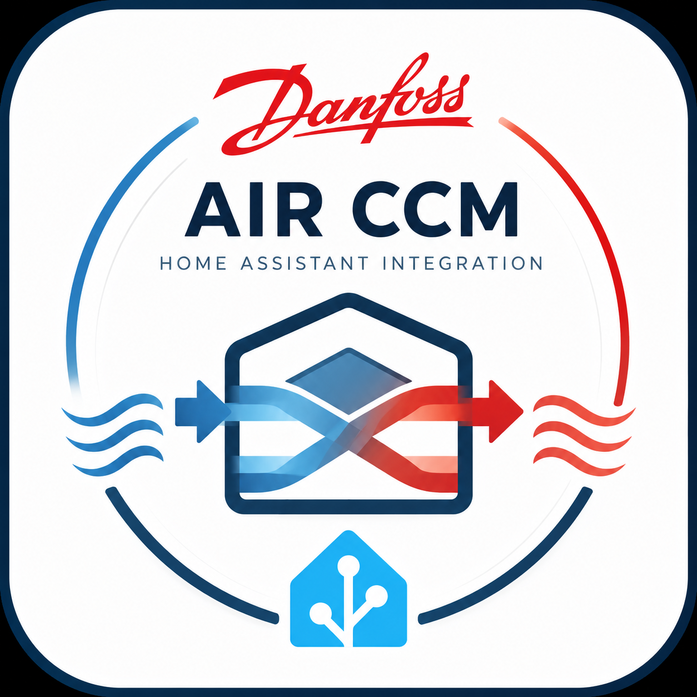

# Danfoss Air CCM for Home Assistant

Native Home Assistant integration for **Danfoss Air CCM** ventilation units using the original Danfoss TCP protocol.

> ⚠️ This project is currently under active development.

<p align="center">
  
</p>

---

# Highlights

- 🚀 Native Danfoss TCP protocol
- 🏠 100% Local communication
- 🔧 Native Home Assistant entities
- ⚡ No cloud
- 🔌 No Modbus
- 🤖 No Node-RED

---

# Status

**Current version:** `0.3.0`

| Component | Status |
|-----------|--------|
| Home Assistant | ✅ |
| Config Flow | ✅ |
| Native TCP | ✅ |
| HACS | 🚧 |
| Fan Control | ✅ |
| Temperatures | ✅ |
| Relative Humidity | ✅ |
| Bypass | ✅ |
| Installer Mode | ✅ |
| Scheduler | 🚧 |

---

# Features

## Communication

- ✅ Native TCP communication (Port **30046**)
- ✅ Local communication only
- ✅ No cloud
- ✅ No Modbus
- ✅ No Node-RED

## Home Assistant

- ✅ Config Flow
- ✅ Native entities
- ✅ Local polling

## Controls

- ✅ Fan Step control (1–10)
- ✅ Basic Supply Step
- ✅ Basic Extract Step
- ✅ Native Bypass switch

## Sensors

- ✅ Outdoor Temperature
- ✅ Supply Temperature
- ✅ Extract Temperature
- ✅ Exhaust Temperature
- ✅ Relative Humidity

## Installer Mode

- ✅ Persistent installer airflow settings
- ✅ Restore Installer Settings

---

# Supported Devices

Verified on:

- Danfoss Air CCM
- Danfoss W1A2

Additional Danfoss Air models will be tested in future releases.

---

# Installation

## HACS

Support for HACS custom repositories is planned.

Until then, install manually.

## Manual Installation

Copy

```text
custom_components/danfoss_air_ccm
```

to

```text
/config/custom_components/
```

Restart Home Assistant.

---

# Supported Parameters

| Address | Parameter | Type | Read | Write |
|--------:|-----------|------|:----:|:-----:|
| 5160 | Current Supply Step | BYTE | ✅ | ❌ |
| 5161 | Current Extract Step | BYTE | ✅ | ❌ |
| 5184 | Basic Supply Step | BYTE | ✅ | ✅ |
| 5185 | Basic Extract Step | BYTE | ✅ | ✅ |
| 5216 | Bypass | BOOL | ✅ | ✅ |
| 5232 | Relative Humidity | PERCENT | ✅ | ❌ |
| 5234 | Outdoor Temperature | SHORT | ✅ | ❌ |
| 5235 | Supply Temperature | SHORT | ✅ | ❌ |
| 5236 | Extract Temperature | SHORT | ✅ | ❌ |
| 5237 | Exhaust Temperature | SHORT | ✅ | ❌ |
| 6017 | Fan Step | BYTE | ✅ | ✅ |

More parameters are continuously being reverse engineered and added.

---

# Home Assistant Entities

## Sensors

- Fan Step
- Current Supply Step
- Current Extract Step
- Outdoor Temperature
- Supply Temperature
- Extract Temperature
- Exhaust Temperature
- Relative Humidity

## Numbers

- Fan Step
- Basic Supply Step
- Basic Extract Step

## Switches

- Bypass

## Buttons

- Restore Installer Settings

---

# Roadmap

## Version 0.4.0

- Boost
- Boost Timer
- Maximum Boost Step
- Alarm Code
- Filter Fouling
- Filter Reset
- Bypass Active

## Version 0.5.0

- Bypass Timer
- Bypass Outdoor Temperature
- Bypass Room Temperature
- Auto Bypass
- Resultant Fan Step

## Version 0.6.0

- Weekly Scheduler
- Weekly Profiles
- Operating Modes

## Version 1.0.0

- Full parameter support
- Automatic device discovery
- HACS release
- Complete diagnostics
- Translation support
- Stable release

---

# Development

This integration communicates directly with the Danfoss controller using the original Danfoss TCP protocol on **port 30046**.

The protocol has been reverse engineered from the official Danfoss PC Tool.

## Design Goals

- Native TCP communication
- Local communication only
- No cloud
- No Modbus
- No Node-RED
- No external dependencies

---

# Project Structure

```text
custom_components/
└── danfoss_air_ccm/
    ├── __init__.py
    ├── button.py
    ├── config_flow.py
    ├── const.py
    ├── coordinator.py
    ├── entity.py
    ├── number.py
    ├── protocol.py
    ├── sensor.py
    ├── storage.py
    └── switch.py
```

---

# Documentation

- 📄 README.md
- 📄 PARAMETERS.md
- 📄 CHANGELOG.md
- 📄 ROADMAP.md

---

# Screenshots

Screenshots are available in the `screenshots` directory.

---

# Contributing

Bug reports, feature requests and pull requests are welcome.

If you discover additional Danfoss Air parameters or own another supported controller, contributions and testing are greatly appreciated.

---

# License

This project is licensed under the MIT License.